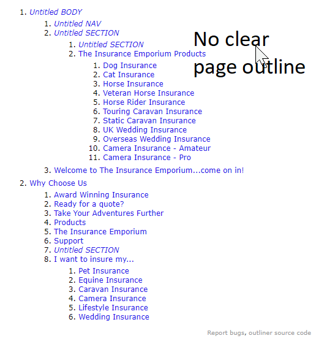

# THE-INSURANCE-EMPORIUM-TEST

### Issue #1: No Clear page outline

> > The outline of a web page is like the table of content of that page, though it is not visible in the web page directly but it's what is presented to screen readers. This website does not have a clear outline.

Example:


---

### Why Outline?

- Helps visually impaired users navigate your site: Screen reader and
  other assistive
- Helps search engines better understand your site structure - SEO.
- devices use this outline to obtain the structure of your web page and
  provide better user experiences.
- Helps users with a keyboard only navigate your site smoothly.
- Helps you and other developers navigate and understand your code
  easily

---

### Proposed Solution

#### Step 1: Start outlining your content (text content)

Example:

```
THE INSURANCE EMPORIUM HHOME PAGE
1. Main Nav
   1. Our Services
   2. Why Choose Us
2. Our Products
   1. Dog Insurance
   2. Cat insurance
3. Why Choose Us
  1. Award Winning Insurance
  2. Ready for a quote?
  3. Products
```

- Step 2: Use Headings h1-h6 appropriately
- Step 3: Use Use sectioning elements: (section, article, aside, main, nav)
- Use grouping elements: (footer, header, div)

Example:

```
<body>
    <!-- Main Navigation -->
    <nav> The INSURANCE EMPORIUM Main Nav <nav>

    <main>
        <header>
            <h1>THE INSURANCE EMPORIUM HHOME PAGE</h1>
        </header>
        <!-- Our Products Section -->
        <section>
            <h2>Our Products</h2>
            <!-- Product#1 -->
            <article>
                <h3>Dog Insurance</h3>
                <p>...</p>
                
            </article>
            <!-- Product#2 -->
            <article>
                <h3>Cat insurance</h3>
                <p>...</p>
                
                <table></table>
            </article>
        </section>
        <!-- ./ End of Our Products Section -->

        <!-- Why Choose Us Section -->
        <section>
            <h2>Why Choose Us?</h2>
            <article><h3>Award Winning Insurance</h3></article>
            <article><h3>Ready for a quote?</h3></article>
        </section>
        <!-- ./End of Why Choose Us Section -->

        <footer>
        </footer>
        <main>
    <footer>
</body>
```

> > Outlining your HTML document makes it easier to read and navigate your site by screen readers, search engines and you/others

> > Using HTML semantically meaningful elements clearly describes its meaning to both the browser and the developer. It conveys what each bit of content on the page structurally means

---

`There is an excessive usage of div tags in your site, rather replace it with more meaningful self explantory tags such as section or article etc`

### Why use semantic HTML?

1. Helps build better site structures
2. Improve websites’ accessibility: Screen readerraille displays,
   magnifiers and other assistive technology deliver more meaningful feedback to the visually impaired users. e.g., this is a section instead of this is a div.
3. Helps search engines better understand your site structure - SEO.
4. Helps you and other developers navigate and understand your code
   easily

`There is no ARIA ROLES`
`The navigation needs redesign`


